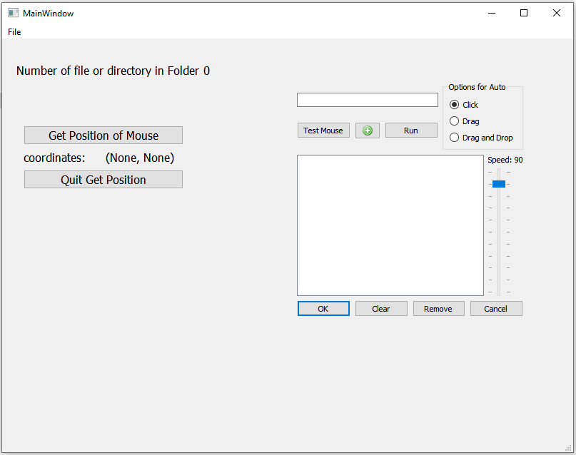

# NgocTool

# Auto Click tool QT C++

This is Auto Click Drag Drop Tool developed by tranducngoc9

**Guide:**

* Click "Get Position of Mouse" Button to get coordinates -> Enter ->Click the **add icon**
* The minimum number of added coordinates **must be 2**
* Click "Run" Button to **run** -> To **stop** press **ESC key**
* **Press Up Key** or **Down Key** to increase or decrease the mouse pointer speed.
* Options for Auto: "Click" to only **click**, "Drag" to only **drag**, "Drag and Drop" to both **drag and drop**

**Note:**

* The program only run on **window OS**
* This applycation buid by **Qt Creater 5.12**. If you only want to run code, please click **releases** to download file zip and extract binary code -> Next you only click **.exe file** to run

Below is an illustration of my application

